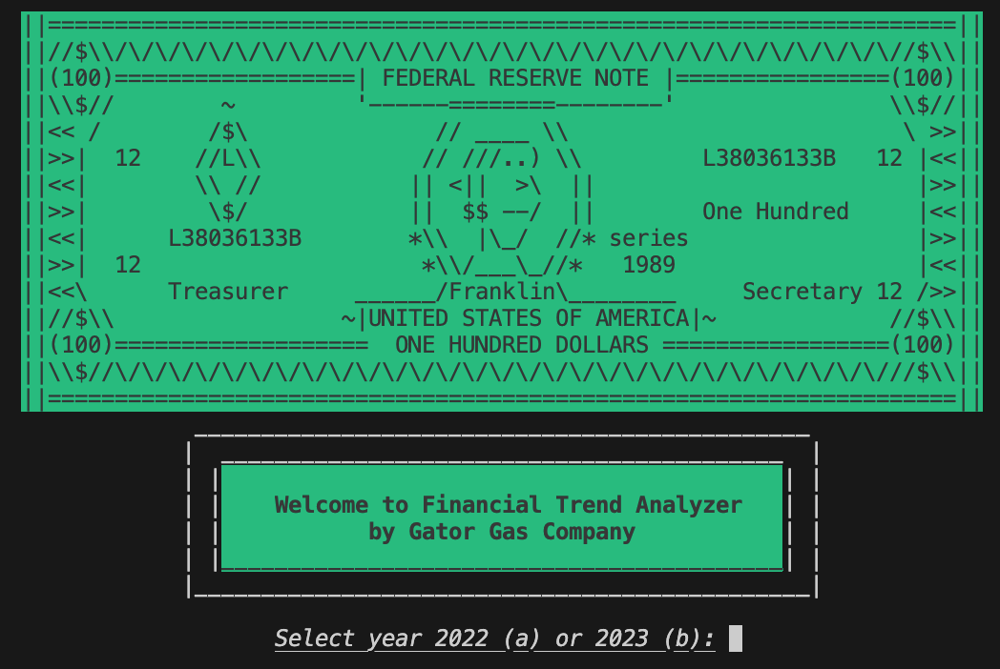
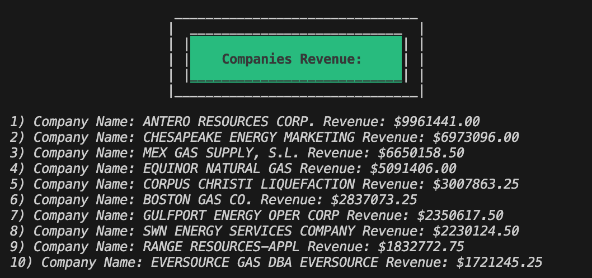
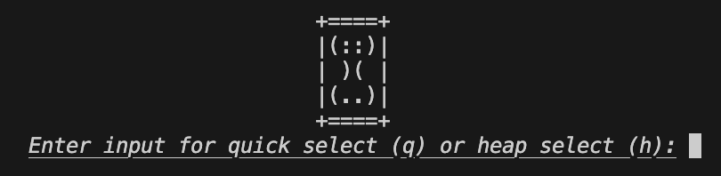
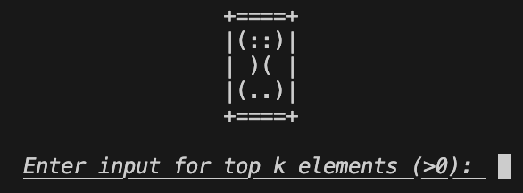
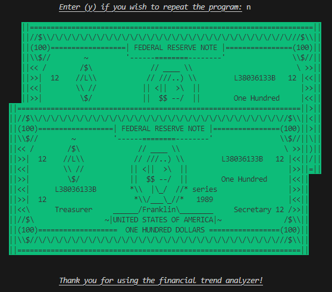

# The Financial Trend Analyzer
### ~ Gator Gas Company ~

# Table of Contents 
- [What is the Financial Trend Analyzer?](#what-is-the-financial-trend-analyzer)
- [Installation](#installation)
- [Commands](#commands)
- [Documentation](#documentation)
- [Contributing](#contributing)

# What is the Financial Trend Analyzer?

The Financial Trend Analyzer for Gator Gas Company is a program by 
Fall 2024 Data Structures and Algorithms (DSA) students Hiral, Sara, and Finn and 
is designed to represent the top-k revenue-generating customers over mutliple
years for large companies (such as oil and gas companies). This tool aims to 
assist large corporations, like the Gator Gas Company, to identify their customer
base and find customer trends in revenue which inform future sales initiatives. 
This project provides insight into how large businesses operate and how data 
structures and algorithms learned in DSA can be applied to solving real-world problems.

The data used for the project includes sales data for Gator Gas Company for 2022
and 2023. The attributes of each sales record are: month of bill, company id, 
company name, contract number, service type, charge type, bill quantity, and bill
amount (also known as revenue) for a total of 328426 rows for 2022 and 300106 for 2023.

The analyzer utilizes either a heapSelect with a minHeap or a quickSelect algorithm
to determine the k companies with the highest total revenue. Revenues are calculated
and stored using a hashMap in both implementations. The algorithms were chosen due to 
their effectiveness in solving k largest problems in real-world scenarios in finance
and business.

The results of our analysis conclude that the time complexities of quickSelect and
heapSelect are similar and logarithmic. Our program successfully handles 300000+
data points at a time and can be easily scaled to further test the algorithms. The 
frontend is implemented in the terminal with ANSI escape codes and ASCII art. See
[Installation](#installation) and [Commands](#commands) for more details on how to run!

Enjoy using *The Financial Trend Analyzer!*

Project released 12/03/24

# Installation
Ensure you have the following: 
- C++ 11.0+
- VSCode
- Terminal
- run using **./financial_trend_analyzer** executable

# Commands

Inputting these commands into the terminal will cause an action: 

- For select year:
  * a: sales data for 2022
  * b: sales data for 2023

- For select algorithm:
  * q: quickSelect
  * h: heapSelect

- For select top-k elements:
  * any integer greater than zero but less than the dataset size
  
- For program repeat:
   * y: repeats program
     
 

# Documentation
Here's the link to our report and video!
[Fall 2024 Project 3 Report](https://docs.google.com/document/d/1Wu2G8IoYMrX9syrV3eqdl_uzYqSufovieuocgwJmX2s/edit?usp=sharing)

# Contributing
**Meet The Hash-Mapping Slashers:**
Contact us at
hiralshukla@ufl.edu,
linsara@ufl.edu,
& finnwalker@ufl.edu

